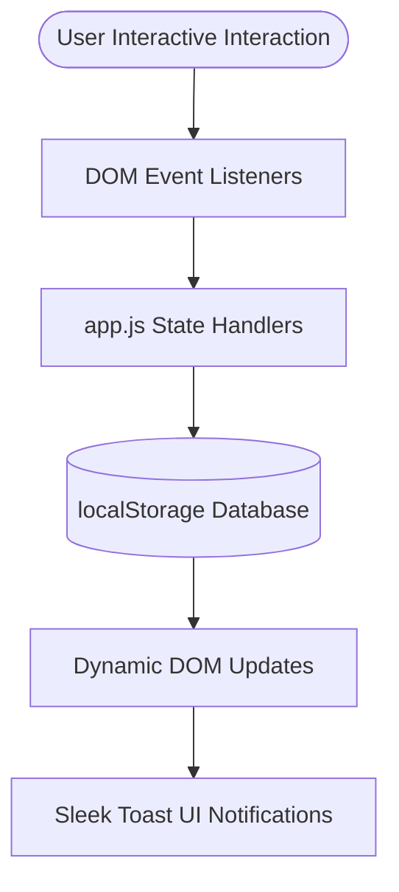

# Cara Technical Architecture Guide 🛠️

This document maps out the system architecture, frontend data models, local storage schemas, and event propagation flows inside the **Cara** E-Commerce client application.

## Overview
Cara is a modern single-page-first progressive frontend architecture powered by HTML5 semantic layout layers, Vanilla CSS grid modules, and state-driven JavaScript components.

## Local Storage Schema Map
The application implements persistent data states using synchronous key-value mappings in `localStorage`:

| Key | Format | Description |
|---|---|---|
| `productsInCart` | `Array<Object>` | Complete shopping cart records (name, price, quantity, size, image). |
| `appliedCoupon` | `String` | Active promo coupon code applied to cart calculations (`CARA20` or `WELCOME10`). |
| `theme` | `String` | Visual dark or light preference setting (`dark` or `light`). |

## Event & Rendering Flow Diagram

## Security Best Practices
- **Strict Client-side Validation**: Interactive inputs utilize built-in sanitization.
- **Toast Messaging Boundaries**: System notifications run non-blocking, isolated timers.
